### Explain中的列

- **id**

  id列的编号是 select 的序列号，id值越大表示该select越先执行，id相同顺序执行。

- **select_type**

  1. **simple**: 简单查询。查询不包含子查询和union

  2. **primary**: 主查询。即最外层select

  3. **subquery**: 子查询（相对于主查询），主查询select中的查询（不在from中)。

  4. **derived**: 衍生查询（相对于主查询），主查询from中的查询。

     ```sql
     explain select (select 1 from actor where id = 1) from (select * from film where id = 1)
     ```

     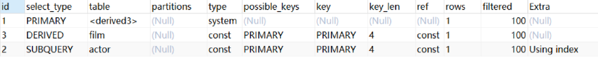

  5. **union**: 在 union 中的第二个和随后的 select

     ```sql
     explain select 1 union all select 1;
     ```

     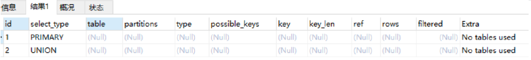

- **type**

  **system > const > eq_ref > ref > range > index > ALL**

  1. **Null**: mysql能够在优化阶段分解查询语句，在执行阶段用不着再访问表或索引。例如：在索引列中选取最小值，可以单独查找索引来完成，不需要在执行时访问表。

     ```sql
     explain select min(id) from film;
     ```

     

  2. **system**: 表里只有一行记录  

  3. **const**: primary key 或 unique key 的所有列与常数比较时，表最多有一个匹配行

     ```sql
     explain extended select * from (select * from film where id = 1) tmp;
     ```

     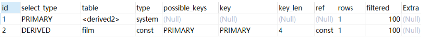

  4. **eq_ref**: 关联查询时，primary key 或 unique key 索引的所有部分被连接使用 ，最多只会返回一条符合条件的记录，==简单的 select 查询不会出现这种 type==。

     ```sql
     explain select * from film_actor left join film on film_actor.film_id = film.id;
     ```

     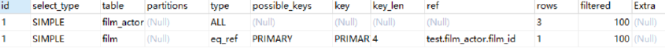

  5. **ref**: 不使用唯一索引(使用普通索引或唯一索引的部分前缀)，可能返回多条记录。

     简单查询（name为普通索引）：

     ```sql
     explain select * from film where name = 'film1';
     ```

     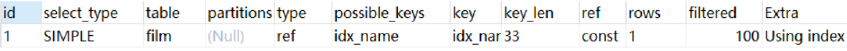

     关联表查询(idx_film_actor_id是film_id和actor_id的联合索引，只用到前缀film_id)：

     ```sql
     explain select film_id from film left join film_actor on film.id = film_actor.film_id;
     ```

     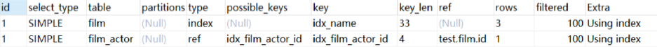

  6. **range**: 范围查找，范围扫描通常出现在 in(), between ,> ,<, >= 等操作中，被检索行使用索引。

     ```sql
     explain select * from actor where id > 1;
     ```

     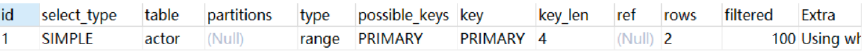

  7. **index**: 查询全表时，若辅助索引树中包含所有查询字段，则去辅助索引中查询所有索引（数据量较少），称之为覆盖索引(Full Index Scan)。用到索引，但是只是遍历索引(叶子)，效率低。

     ```sql
     explain select * from film;
     ```

     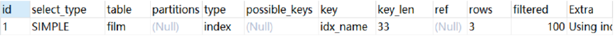

  8. **All**: 全表扫描，扫描聚簇索引，遍历聚簇索引的叶子。

     ```sql
     explain select * from actor;
     ```

     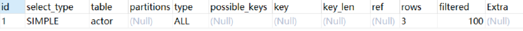

- **possible_keys**

  可能使用的索引。explain 时可能出现 possible_keys 有列，而 key 显示 NULL 的情况，这种情况是因为表中数据不多，mysql认为索引对此查询帮助不大，选择了全表查询。

- **key列**

  这一列显示mysql实际采用哪个索引来优化对该表的访问。

- **key_len**

  使用索引的字节总数，通过这个值可以算出具体使用了(联合)索引中的哪些列。

  ```sql
  explain select * from film_actor where film_id = 2;
  ```

  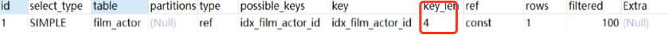

  film_actor的联合索引 idx_film_actor_id 由 film_id 和 actor_id 两个int列组成，并且每个int是4字节。通过结果中的key_len=4可推断出查询使用了第一个列：film_id列来执行索引查找。

  1. **计算规则**

     **字符串**：

     ​	char(n)：n字节长度

     ​	varchar(n)：如果是utf-8，则长度 3n + 2 字节，加的2字节用来存储字符串长度

     **数值类型**：

     ​	tinyint：1字节

     ​	smallint：2字节

     ​	int：4字节

     ​	bigint：8字节　　

     **时间类型**：

     ​	date：3字节

     ​	timestamp：4字节

     ​	datetime：8字节

     如果字段允许为 NULL，需要1字节记录是否为 NULL

- **ref**

  这一列显示了在key列记录的索引中，表查找值所用到的列或常量，常见的有：const（常量），字段名（例：film.id）

- **rows**

  这一列是mysql估计要读取并检测的行数，注意这个不是结果集里的行数。

- **Extra**

  这一列展示的是额外信息。常见的重要值如下：

  1. **Using index**: 使用覆盖索引(结果集在辅助索引树中全部包含)

     ```sql
     explain select film_id from film_actor where film_id = 1;
     ```

     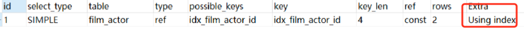

     问题：为什么这个type不是index而是ref？

     答：因为这个查询的不是全表数据。

  2. **Using where**: 表示MySQL服务器在存储引擎收到记录后进行“后过滤”（Post-filter）,如果查询未能使用索引，Using where的作用只是提醒我们==MySQL将用where子句来过滤结果集==。这个==一般发生在MySQL服务器，而不是存储引擎层==。一般发生在不能走索引扫描的情况下或者走索引扫描，但是有些查询条件不在索引当中的情况下。

     ```sql
     mysql> explain select * from actor where name = 'a';
     ```

     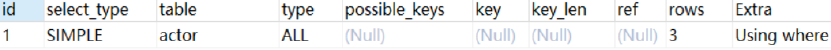

  3. **Using index condition**: 查询的列不完全被索引覆盖，where条件中是一个前导列的范围；

  4. **Using temporary**: 用到临时表

  5. **Using filesort**:  MySQL中无法利用索引完成的排序操作称为“文件排序”

  6. **Select tables optimized away**: 使用某些聚合函数（比如 max、min）来访问存在索引的某个字段.

http://fivezh.github.io/2020/01/19/mysql-icp/?utm_source=tuicool&utm_medium=referral

https://www.cnblogs.com/kerrycode/p/9909093.html

