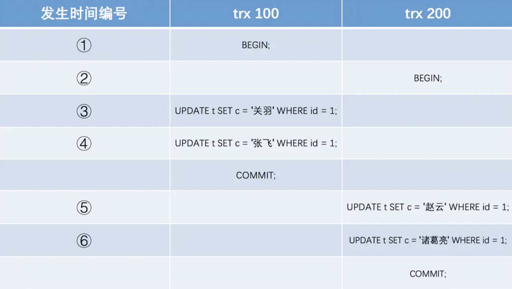
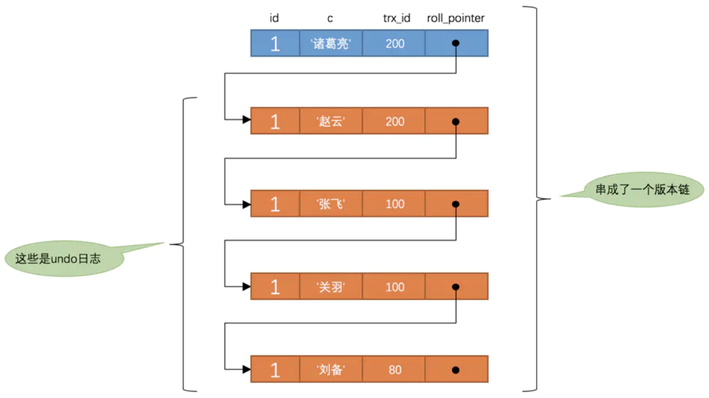

# MySQL锁与事务

本笔记主要针对InnoDB引擎

## 锁

锁是区分数据库区别于文件系统的一个关键特性。


### lock与latch

二者区别：

|          | Lock                                         | Latch                |
| -------- | -------------------------------------------- | -------------------- |
| 对象     | 事务                                         | 线程                 |
| 保护     | 数据库内容                                   | 内存数据结构         |
| 持续时间 | 整个事务过程                                 | 临界资源访问过程     |
| 模式     | 行锁、表锁、意向锁                           | 读写锁、互斥量       |
| 死锁     | 通过waits-for graph、timeout等级制检测与处理 | 无检测与处理机制     |
| 存在于   | Lock Manager的哈希表中                       | 每个数据结构的对象中 |

latch相当于内存的锁，lock相当于数据库对象(表、行等)的锁。比如数据缓存中的某个块要被读取，我们会获得这个块的latch。这个过程叫做pin，另外一个进程恰好要修改这个块，他也要pin这个块，此时他必须等待。


### lock锁类型

- 共享锁(S Lock)：允许事务读一行数据

  ```sql
  -- 事务要获取某些行的 S 锁，必须先获得表的 IS 锁。
  SELECT column FROM table ... LOCK IN SHARE MODE;
  ```

  

- 排他锁(X Lock)：允许事务删除或更新一行数据

  ```sql
  -- 事务要获取某些行的 X 锁，必须先获得表的 IX 锁。
  SELECT * FROM users WHERE id = 6 FOR UPDATE;
  ```

- 意向共享锁(IS Lock)：事务想要获得一张表中某几行的共享锁
- 意向拍他锁(IS Lock)：事务想要获得一张表中某几行的排他锁

意向锁与行级锁的兼容性：指对同一记录(row)锁的兼容性情况

|      | IS     | IX     | S      | X      |
| ---- | ------ | ------ | ------ | ------ |
| IS   | 兼容   | 兼容   | 兼容   | 兼容   |
| IX   | 兼容   | 兼容   | 不兼容 | 不兼容 |
| S    | 兼容   | 不兼容 | 兼容   | 不兼容 |
| X    | 不兼容 | 不兼容 | 不兼容 | 不兼容 |

意向锁为表级锁，是由S、X行锁触发。故研究其与行锁的兼容性其实意义不大。百度百科中意向锁的意义：

> 如果另一个任务试图在该表级别上应用共享或排它锁，则受到由第一个任务控制的表级别意向锁的阻塞。第二个任务在锁定该表前不必检查各个页或行锁，而只需检查表上的意向锁。

意向锁是为了解决行锁与==表锁==(Mysql Server提供，非InnoDB)之间互斥关系而存在的。如：

事务 A 获取了某一行的排他锁

```mysql
-- 会先获取表的IX锁
SELECT * FROM users WHERE id = 6 FOR UPDATE;
```

事务 B 想要获取该行对应表的表锁：

```mysql
LOCK TABLES users READ;
```

由于该表存在IX锁，与表锁互斥，所以事务B需等待事务A释放IX锁才能获取到表锁。


### 行锁的3种算法

InnoDB有3种行锁的算法：

- Record Lock: 行锁。==锁的索引，而非自身==。若没设置索引，则会使用隐式的主键(聚簇索引)来进行锁定。

- Gap Lock: 间隙锁。锁定记录(索引)之间的范围，但不包含记录(索引)本身。

- Next-Key Lock: Gap Lock + Record Lock，锁定范围并锁定记录(索引)本身

  如一个索引字段包含1、3、5、8，11几个值，则可能被锁定的区间为：

  (负无穷, 1]

  (1, 3\]

  (3, 5\]

  (5, 8\]

  (8, 11\]

  (11, 正无穷)

  - 若执行update account set name = 'wang' where id > 7 and id <10(锁住8～18)
  
  
  则被锁定区间为[5, 11)，因为7～10跨越了几个区间。
  
  - 若执行select * from film where name = 8 for update;
  
    则锁定区间为[5,11)，next-key会锁住当前值所在区间，并对下一个键值加gap lock。
  
    即插入5、6、7、8、9、10被阻塞、11不会阻塞(亲测)
  
  问题：为什么锁区间是左开右闭，测试明明是左闭右开
  
- Next-Key Lock优化：当查询的索引含有唯一属性的时候，Next-Key Lock 会进行优化，将其降级为Record Lock，即仅锁住索引本身，不是范围。

## 事务

innodb支持事务，myisim不支持事务。


### 事务的基本特性

理论上说，事务必须同时满足四个特性。

- 原子性(atomicity)

  事务中的所有操作，要么都做，要么都不做。

- 一致性(consistency)

  事务在执行前后数据库的状态保持一致，完整性约束没有被破坏。

- 隔离性(isolation)

  事务提交前对其他事务不可见。通常使用锁来实现。

- 持久性(durability)

  一旦事务提交，则其所做的修改将会永远保存到数据库中。即使系统发生崩溃，事务执行的结果也不能丢失。


### 并发一致性问题

- 丢失修改

  T1 和 T2 两个事务都对一个数据进行修改，T1 先修改，T2 随后修改，T2 的修改覆盖了 T1 的修改。（改改—没改完就改）

  **解决：一级封锁协议**

  ​		事务 T 要修改数据 A 时必须加 X 锁，直到 T 结束才释放锁。

  **问题：**在一级封锁协议中，如果仅仅是读数据不对其进行修改，是不需要加锁的，所以它不能保证可重复读和不读“脏”数据（2）。

- 读脏数据

  T1 修改一个数据，T2 随后读取这个数据。如果 T1 撤销了这次修改(回滚)，那么 T2 读取的数据是脏数据。（改读改—没改完就读）

  **解决：二级封锁协议**

  ​	在一级的基础上，要求读取数据 A 时必须加 S 锁，读取完马上释放 S 锁。

  **问题：**由于读完数据即可释放S锁，所以它不能保证可重复读（3）。

- 不可重复读

  T2 读取一个数据，T1 对该数据做了修改。如果 T2 再次读取这个数据，此时读取的结果和第一次读取的结果不同。（读改读—没读完就改）

  在一级的基础上，要求读取数据 A 时必须加 S 锁，直到事务结束了才能释放 S 锁。

  （可以解决不可重复读的问题，因为读 A 时，其它事务不能对 A 加 X 锁，从而避免了在读的期间数据发生改变。）

- 幻影读

  T1 读取某个范围的数据，T2 在这个范围内插入新的数据，T1 再次读取这个范围的数据，此时读取的结果和和第一次读取的结果不同。

  **小结：不可重复读的和幻读很容易混淆，不可重复读侧重于修改，幻读侧重于新增或删除。解决不可重复读的问题只需锁住满足条件的行，解决幻读需要锁表**

### 事务的隔离级别

- 未提交读(read uncommitted)

- 提交读(read committed)

- 可重复读(repeatable read) innodb引擎默认

- 可串行化(serializable)

  以上3种隔离级别都允许对同一条记录进行`读-读`、`读-写`、`写-读`的并发操作，如果我们不允许`读-写`、`写-读`的并发操作

### MVCC

多版本并发控制（Multi-Version Concurrency Control, MVCC）是 MySQL 的 InnoDB 存储引擎实现隔离级别的一种具体方式，用于实现==提交读==(RC)和==可重复读==(RR)这两种隔离级别。而未提交读隔离级别总是读取最新的数据行，无需使用 MVCC。可串行化隔离级别需要对所有读取的行都加锁，单纯使用 MVCC 无法实现。

- 快照读与当前读

  在==RR级别==中，通过MVCC机制，虽然让数据变得可重复读，但我们读到的数据可能是历史数据，不是数据库最新的数据。这种读取历史数据的方式，我们叫它快照读 (snapshot read)，而读取数据库最新版本数据的方式，叫当前读 (current read)。
  
  select操作是innodb默认会执行快照读，对于会对数据修改的操作(update、insert、delete)都是采用当前读的模式。
  
  select的当前读需要手动的加锁：
  
  ```sql
  select * from table where ? lock in share mode;
  select * from table where ? for update;
  ```

- 版本链与undo日志

  对于使用`InnoDB`存储引擎的表来说，它的聚簇索引记录中都包含两个必要的隐藏列：

  - `trx_id`：每次对某条聚簇索引记录进行改动时，都会把对应的事务id赋值给`trx_id`隐藏列。
  - `roll_pointer`：每次对某条聚簇索引记录进行改动时，都会把旧的版本写入到`undo日志`中，然后这个隐藏列就相当于一个指针，可以通过它来找到该记录修改前的信息。

- MVCC核心思想

  对于表t，假设插入该记录的事务id为`80`

  ```sql
  mysql> SELECT * FROM t;
  +----+--------+
  | id | c      |
  +----+--------+
  |  1 | 刘备   |
  +----+--------+
  1 row in set (0.01 sec)
  ```

  则当前版本链如下：

  

  

  

  假设之后两个`id`分别为`100`、`200`的事务对这条记录进行`UPDATE`操作，操作流程如下：

  

  

  

  每次对记录进行改动，都会记录一条`undo日志`，并对应一个`roll_pointer`。利用`roll_pointer`可以将undo日志中该条数据所有改动串起来，形成`版本链`如下：

  

  

  

  对于RR级别，第一次执行查询sql时会生成当前事务的一致性视图==read-view==。

  对于RC级别，每一次执行查询sql时会生成当前事务的一致性视图==read-view==。

  ReadView由执行查询时所有未提交事务id数组（称之为`m_ids`，数组里最小的id为min_id）和已创建的最大事务id（max_id）组成，记录列表中最小的事务id为在访问某条记录时有如下规则：

  注意：m_ids之中为当前未提交数组，之外包括==已提交==事务以及==未来的事务==。

  - 如果被访问版本的`trx_id`属性值小于min_id，表明生成该版本的事务在生成`ReadView`前已经提交，所以该版本可以被当前事务访问。

  - 如果被访问版本的`trx_id`属性值大于max_id，表明生成该版本的事务在生成`ReadView`后才生成，所以该版本不可以被当前事务访问。

  - 如果被访问版本的`trx_id`属性值在min_id与max_id之间，那就需要判断一下`trx_id`属性值是不是在`m_ids`列表中，如果在，说明创建`ReadView`时生成该版本的事务还是活跃的，该版本不可以被访问；如果不在，说明创建`ReadView`时生成该版本的事务已经被提交，该版本可以被访问。

    id 在 m_ids 中：表示未提交，不可访问

    id 不在 m_ids 中：

    - 已提交
    - 在未来：id > max_id

  **注意：**begin/start transaction 命令并不是一个事务的起点， 在执行到它们之后的第一个==修改==操作InnoDB表的语句，事务才真正启动，才会向mysql申请事务id，mysql内部是严格按照事务的启动顺序来分配事务id的。


## 常用命令

- 查看事务隔离级别

  select @@transaction_isolation;

- 查看当前数据库所有表名

  select table_name from information_schema.tables where table_schema='当前数据库';

- 显示所有数据库

  show databases;

- 开启事务、提交事务、会滚事务

  start transaction;  、  Commit;   、 Rollback;

## 面试问题补充

- 可重复读如何避免幻读